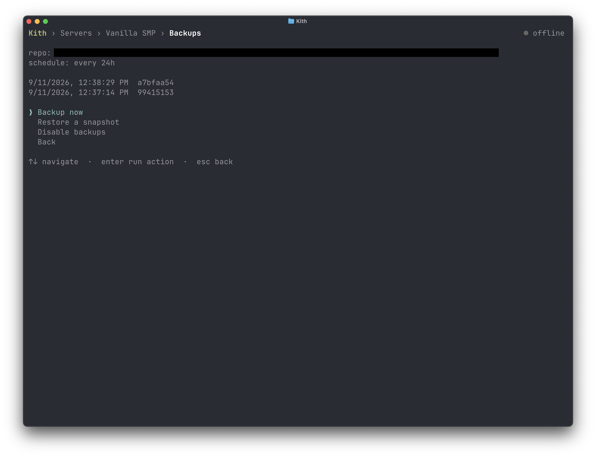

# Backups

Kith backs servers up with [restic](https://restic.net/), running in a sidecar container alongside each server via the itzg mc-backup image. Snapshots are deduplicated, incremental, and encrypted. Restoring to any snapshot takes a few keystrokes from the server's screen in the app.

Backups are opt-in globally. Nothing is backed up until you set a destination.



## How it works

Backups are configured once, globally, and applied to every server. Set a destination and a schedule in kith's environment and you're done. You never set up backups for an individual server.

Each server gets its own restic repository at `<KITH_BASE_BACKUP_DEST>/<server id>` and its own backup sidecar (the itzg mc-backup image) that snapshots the server's data directory on the schedule. The sidecar initializes the repository itself on first run, so there's no setup step beyond adding it.

Because the config is global, kith keeps every server's sidecar in sync with it:

- **New servers** get a backup sidecar automatically as soon as a destination is set.
- **Existing servers** are compared against the current global config. When a server's sidecar no longer matches (destination, schedule, password, or backend credentials changed), kith flags it on the server's screen and offers to migrate the sidecar to the new config, moving the existing snapshot history along to the new destination.
- **If backups are turned off globally,** servers that still have a sidecar keep backing up on their last config until you decide per server: keep backing up, or remove the sidecar.

Servers can opt out individually. Disabling backups for a server removes its sidecar but keeps the repository, so re-enabling picks up where it left off. The choice is recorded as a label on the compose project, so an opted-out server isn't nagged to set backups up again.

One thing to know before changing a global setting: the **password** is baked into each repository when it's initialized. Kith can update a sidecar's destination or schedule in place, but if you change `KITH_BACKUP_PASSWORD` your existing repositories can't be opened with the new password. Keep the old one for restores, or start fresh at a new destination.

## Enabling backups

Two variables turn backups on:

```bash
# A local path matching your install model (see Local backups below):
export KITH_BASE_BACKUP_DEST=~/.local/share/kith/backups   # per-user install
# export KITH_BASE_BACKUP_DEST=/var/backups/kith           # global install
export KITH_BACKUP_PASSWORD='a-long-random-password'
```

- `KITH_BASE_BACKUP_DEST` sets where repositories live. Each server gets its own repository at `<dest>/<server id>`. A plain path is a local directory. A URL with a scheme prefix (`s3:`, `b2:`, `azure:`, `gs:`, `rclone:`) is a remote restic repository.
- `KITH_BACKUP_PASSWORD` is the password every repository is encrypted with. Required when a destination is set, and kith refuses to start without it. Don't reuse this password anywhere else.

## Local backups

The most common setup backs up to a directory on the same machine. Recommended locations match your install model:

- **Per-user install.** Anything under your home directory works, but the natural spot is alongside the other kith data:

  ```bash
  export KITH_BASE_BACKUP_DEST=~/.local/share/kith/backups
  ```

  If you've set `XDG_DATA_HOME`, use `$XDG_DATA_HOME/kith/backups` instead to keep everything in one place.

- **Global install.** `/var/backups/kith`, following the [Filesystem Hierarchy Standard](https://refspecs.linuxfoundation.org/FHS_3.0/fhs_3.0.pdf) (the same `var/backups` convention, on non-program-specific data). This matches the recommended layout in [Installation](installation.md#global-install):

  ```bash
  export KITH_BASE_BACKUP_DEST=/var/backups/kith
  ```

Whichever you pick, create the directory with the right ownership before first run. For per-user that's `mkdir -p ~/.local/share/kith/backups`. For global, add it to the `install -d` commands in [Installation](installation.md#global-install):

```bash
sudo install -d -o root -g kith -m 2770 /var/backups/kith
```

Local backups protect you against accidents and bad updates, not disk failure. If the machine's storage is the thing you're worried about, use a [remote backend](#remote-backends) as well, or instead.

## Schedule and retention

Backups run on the configured schedule only. Starting a server does not trigger a backup, so frequently started and stopped servers don't pile up snapshots. The first backup lands one interval after the server starts.

| Variable                      | Default   | Description                                     |
| ----------------------------- | --------- | ----------------------------------------------- |
| `KITH_BACKUP_INTERVAL`        | `24h`     | Snapshot interval (sleep format, for example `2h 30m`). |
| `KITH_BACKUP_CRON_SCHEDULE`   | _(unset)_ | Cron expression (for example `0 4 * * *`). Overrides the interval for clock-based timing. |
| `KITH_BACKUP_PRUNE_RETENTION` | _(unset)_ | Restic retention policy (for example `--keep-within 7d`). Unset keeps every snapshot. |

You can also take a snapshot on demand from the app's backup screen, useful before doing anything risky. Individual servers can opt out of backups entirely.

## Remote backends

Point `KITH_BASE_BACKUP_DEST` at a restic URL and export the matching credentials. Kith forwards them to the backup sidecar:

```bash
# S3
export KITH_BASE_BACKUP_DEST=s3:s3.amazonaws.com/my-backup-bucket
export AWS_ACCESS_KEY_ID=…
export AWS_SECRET_ACCESS_KEY=…

# Backblaze B2
export KITH_BASE_BACKUP_DEST=b2:my-backup-bucket
export B2_ACCOUNT_ID=…
export B2_ACCOUNT_KEY=…
```

Azure (`azure:`) and Google Cloud (`gs:`) work the same way. See the [configuration reference](configuration.md#cloud-credentials) for the full variable list per backend.

Scope cloud credentials to backups only: an IAM user limited to the backup bucket, a B2 _application key_ (never the master key), an Azure SAS limited to the backup container. If they leak, the blast radius is your backup storage, not your cloud account.

## Restoring

Restore from the server's backup screen in the app. Pick a snapshot and kith rolls the server's data directory back to exactly that state. A restore can't run while the server is up, so stop it first.

## Security

Backup secrets (the restic password and any cloud credentials) are stored **in plaintext in each server's `docker-compose.yml`**. Anyone who can read that file holds the credentials, and anyone who can run `docker` on the host can extract them from the sidecar container's config regardless of file permissions. Practical guidance:

- **Per-user install.** Nothing to do. Compose files default to mode `600`, readable by you alone.
- **Global install.** Set `KITH_SECRET_FILE_MODE=660` so group members can read the compose files, and treat group membership as the admin boundary. Only add people you'd trust with the credentials.
- Anyone in the `docker` group is effectively root on the host regardless. Group-based access to docker is not a security boundary.
