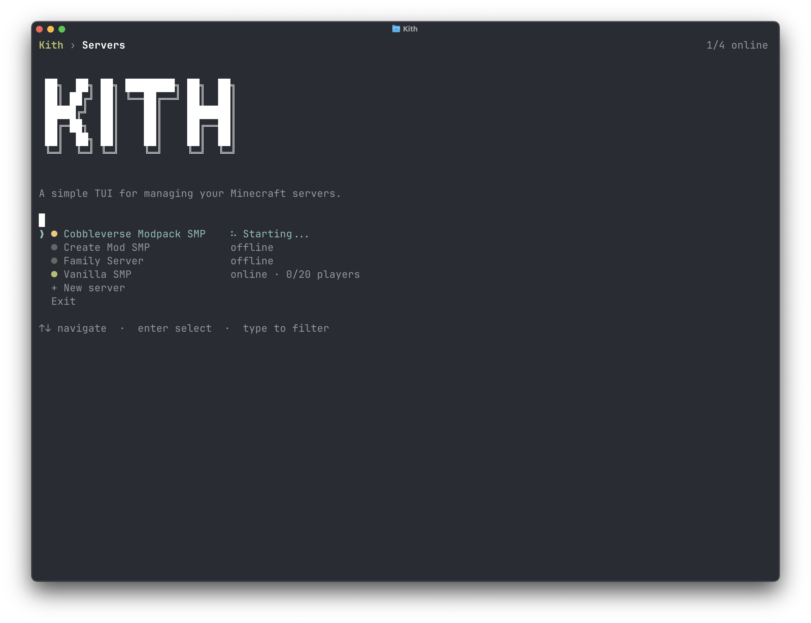
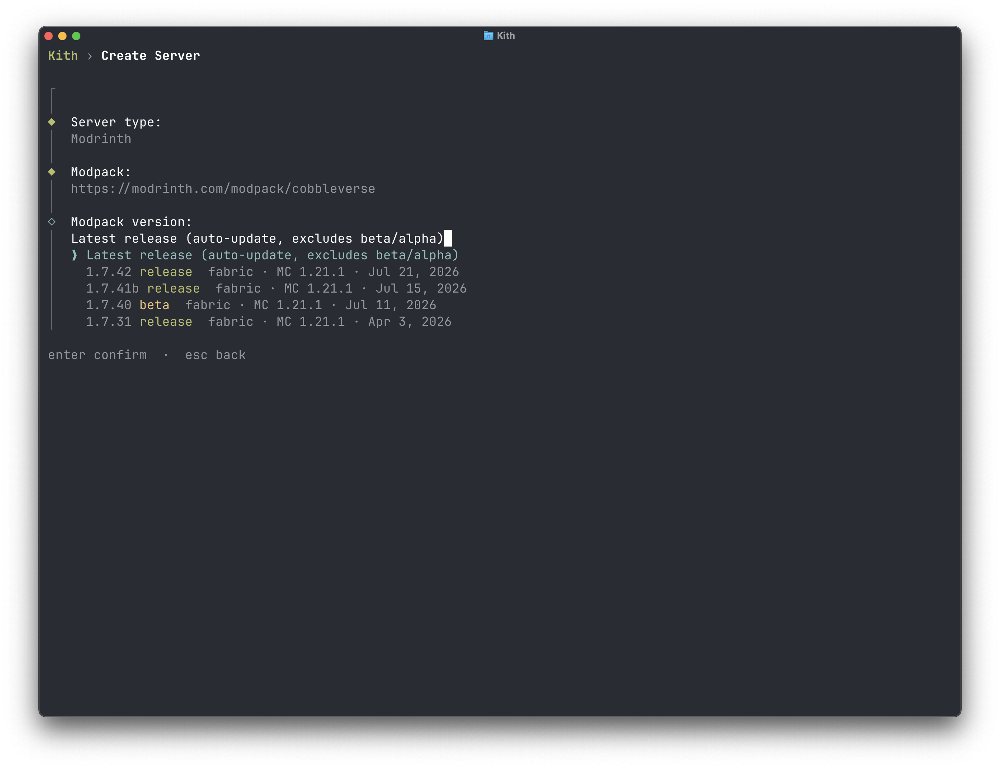
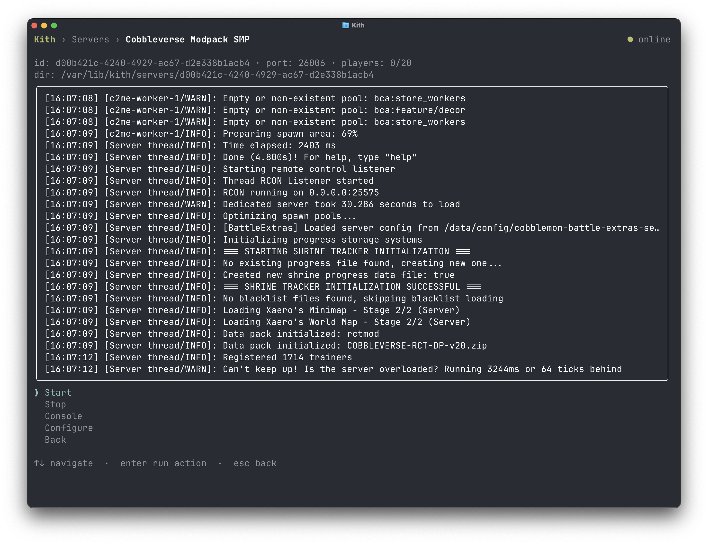
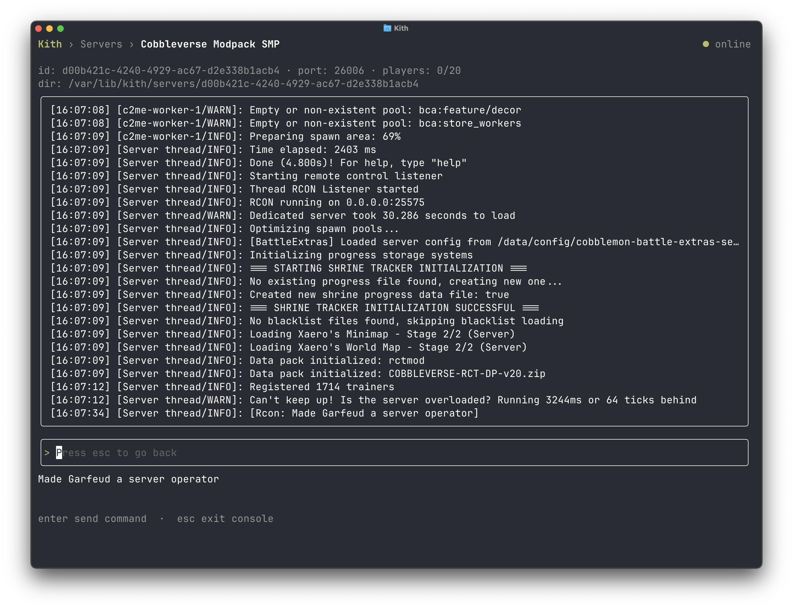
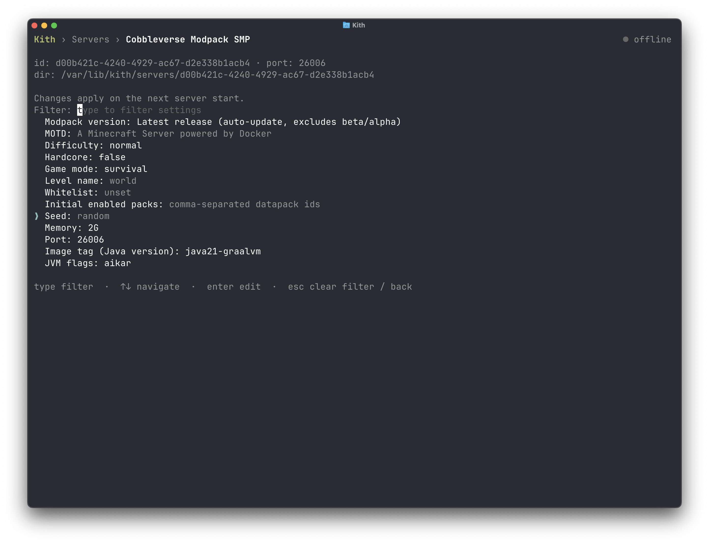

# Usage

Everything happens inside the TUI.

## Server list

The home screen shows live status and player counts for every server. From here you pick a server to work with, or create a new one.

### Creating a server

The server wizard walks you through creating a server. Paste a modpack link and kith validates it, lists every published version with its loader and release channel, and installs it. Vanilla servers work too.

## Server details

Select a server to manage it: start and stop it, stream logs, run console commands, and edit memory, port, version, and modpack settings.

### Console

Watch logs stream by and run console commands without leaving the app.

### Configure

Edit memory, port, version, and modpack settings per server. Kith rewrites the server's `docker-compose.yml` on changes, preserving anything it doesn't manage.

## Backups

Take snapshots on demand, browse snapshot history, restore to any snapshot. See [Backups](backups.md).

## How it works

Each server is a directory under `KITH_SERVERS_DIR` (`~/.local/share/kith/servers` by default) containing:

- `docker-compose.yml`, the server definition. A standard compose file you can read and edit.
- `patches.json`, your config patches, re-applied on every start. See [Patching mod configs](patching.md).
- `data/`, the server's live data: world, `server.properties`, mods, plugins. Mounted into the container at `/data`.

Everything in there is yours. Edit configs directly, drop files into `data/`, add services to the compose file. Kith only rewrites the parts it manages and preserves the rest. Servers are ordinary Docker Compose projects, so `docker compose` commands work in the directory too.

## Removing a server

Stop it, then delete or move its directory out of `KITH_SERVERS_DIR`. There's no delete command in the app yet. The directory _is_ the server, so removing it removes the server. Backup repositories live separately under `KITH_BASE_BACKUP_DEST` and aren't touched.
